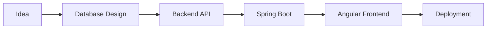

<div align="center">


<br>


</div>

---

# ABOUT

```yaml
name: Moises Gonzalez
location: Colombia
role: Backend / Full Stack Developer
education: ITM - SaaS Solutions Development
main_languages:
  - C#
  - Java
  - SQL
currently_learning:
  - Spring Boot
  - Angular
  - PostgreSQL
focus:
  - APIs
  - Backend Architecture
  - Database Design
  - Full Stack Applications
````

---

# TECH STACK

<div align="center">


</div>

---

# FEATURED PROJECTS

<div align="center">

<table>
<tr>
<td width="50%">

## RESTAURANT RESERVATION SYSTEM

Full Stack reservation management system.

### STACK

* Spring Boot
* Angular
* PostgreSQL
* REST API

### FEATURES

* Reservation management
* Backend architecture
* API communication
* Database integration

</td>

<td width="50%">

## C# STRUCTURES & OOP

Collection of backend and logic-focused projects.

### TOPICS

* Linked Lists
* Inheritance
* Algorithms
* File Handling
* Matrix Operations
* Object-Oriented Design

</td>
</tr>
</table>

</div>

---

# GITHUB ANALYTICS

<div align="center">


</div>

---

# CONTRIBUTION GRAPH

<div align="center">


</div>

---

# CURRENT WORKFLOW

<div align="center">



</div>

---

# CONNECT

<div align="center">

<a href="mailto:moisoyt@gmail.com">

</a>

<a href="https://www.linkedin.com/in/moises-gonzalez-navarro-979091384/">

</a>

<a href="https://github.com/gnmoiso">

</a>

</div>

---

<div align="center">


</div>
```
